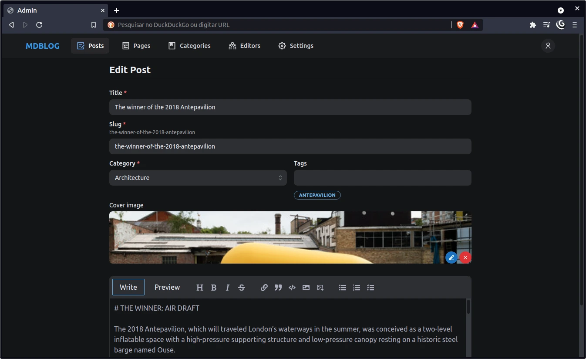

# MDBlog

This is a serverless blog CMS that create posts written in markdown syntax and store in MongoDB. Other management functions are included, like manage users, pages and categories. It supports images upload and emails. This CMS generates endpoints to be used in a headless app.

## It's alive

In this demo, you don't need to login, but you only can see the information.

[https://mdblog-cms.vercel.app/](https://mdblog-cms.vercel.app/)

## Screenshots




## About the project

This project is only the administration for the blog. For authentication I'm using here [NextAuth](https://next-auth.js.org/). To styling I've got the Mantine Design System but for some adjustments I had to get classes from Tailwind. To make the API I used the nextjs API support in node. It provides endpoints for users, posts, pages, categories and settings.

- https://mdblog-cms.vercel.app/api/posts
- https://mdblog-cms.vercel.app/api/pages
- https://mdblog-cms.vercel.app/api/categories
- https://mdblog-cms.vercel.app/api/users
- https://mdblog-cms.vercel.app/api/settings

## Stack

- [React](https://reactjs.org/)
- [Next.js](https://nextjs.org)
- [Mantine Design System](https://mantine.dev/)
- [Tailwind](https://tailwindcss.com/)
- [MongoDB](https://www.mongodb.com/)
- [Cloudinary](https://cloudinary.com/)
- [MailJet](https://www.mailjet.com/)

## Getting Started

1. Clone the repository

```bash
git clone https://github.com/endopedro/mdblog-cms.git
```

2. Then create and fill the .env file (based on .env.example) with your services credentials and app information.

3. Install dependencies

```bash
yarn
```

4. Fire up the server and watch files

```bash
yarn dev
```

5. Go to the address [http://localhost:3000/](http://localhost:3000/)
